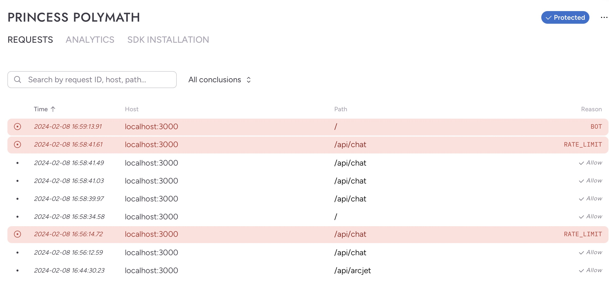

# Example chat-bot Application using ArcJet and Vercel

## Technologies

This project uses the following technologies to create a simple chat application

- [Vercel AI SDK](https://urldefense.proofpoint.com/v2/url?u=https-3A__sdk.vercel.ai_docs&d=DwMFaQ&c=euGZstcaTDllvimEN8b7jXrwqOf-v5A_CdpgnVfiiMM&r=GDjTH4jk81RaRnAFrjtxch_TrjplwTGBmljld5IQL0c&m=yRG9QWKauqhz-avNRlSCAzfH9Ryoe-8k0mAoeB_Y6j86jTkpVwstKwEl10ltNYqc&s=uQnv5BIKERWVFSf_9vKvvL_LkGhEpG9-VgUgNYgPX3I&e=)
- ArcJet:
  - [Bot Protection](https://docs.arcjet.com/bot-protection/quick-start/nextjs)
  - [Rate Limiting](https://docs.arcjet.com/rate-limiting/quick-start/nextjs)

This project can be used as an example of how to integrate ArcJet into your application. The libraries seamlessly integrate into your NextJs code so you can add security functionality into your application without a lot of fuss.

### [Bot Protection](https://docs.arcjet.com/bot-protection/quick-start/nextjs)

Bots can be helpful entities, as with search engines and similar clients. However, many can be abusive to your platform, so it is beneficial to integrate some sort of bot controls to declare what kind of bots are allowed and reject the remainder.

The ArcJet [Bot Protection](https://docs.arcjet.com/bot-protection/quick-start/nextjs)
provides the following features:

- By default it does not block any bot types. You configure exactly which bots you don't want to allow, and ArcJet does the work for you.
- You can restrict bot access based on a system which scores traffic based on how likely it is to be a bot.
- You can choose to allow different bots for different parts of your application, so you could allow bots on search pages but not on user pages.
- ArcJet's returned values give more information about where the traffic came from, whether it is proxied, and other information designed to help you implement the bot protection successfully.
- [Bot Protection](https://docs.arcjet.com/bot-protection/quick-start/nextjs)
  works best when combined with Rate Limiting to keep malicious clients from interrupting the functionality of your site.

### [Rate Limiting](https://docs.arcjet.com/rate-limiting/quick-start/nextjs)

[Rate Limiting](https://docs.arcjet.com/rate-limiting/quick-start/nextjs) is a feature that's important for protecting applications. It can help you prevent brute force attacks, excessive API requests, or limit the throughput given to bots. ArcJet's [Rate Limiting](https://docs.arcjet.com/rate-limiting/quick-start/nextjs) keeps track of requests for you and handles requests appropriately.

- The [Rate Limiting](https://docs.arcjet.com/rate-limiting/quick-start/nextjs) configuration gives you controls to define what routes are covered, and set functionality for the matched route.
- It doesn't require additional infrastructure to handle requests.
- With the ArcJet SDK it is easy to set up basic rate limiting.
- An initial request from a client will get a slight increase in latency, around 10-20 ms. ArcJet can then cache the decision locally so that subequent requests will not get the hit.

## [Getting Started with NextJS](https://docs.arcjet.com/get-started/nextjs)

First, you'll need to [Sign up for ArcJet](https://app.arcjet.com/), create a site and get a site key.

Because this example uses OpenAI you will also need to get an API key from [OpenAI](https://openai.com)

Next, set up your development environment on your localhost, or you can choose to use [Github Codespaces](https://github.com/codespaces/new?template_repository=synedra/arcjet-example) to run it in a virtual environment.  

If you are working locally, follow these steps.

```bash
git clone https://github.com/synedra/arcjet-example
cd arcjet-example
npm install
```

Whether you are using localhost or Github Codespaces, you need to set your ARCJET_KEY and OPENAI_API_KEY environment variables.  Create a .env file with the following contents:

``` bash
ARCJET_KEY=<YOUR_ARCJET_KEY>
OPENAI_API_KEY=<YOUR_OPENAI_API_KEY>
```

Finally, run the development server using npm (or your favorite js package manager):

```bash
npm run dev
```

Open [http://localhost:3000](http://localhost:3000) with your browser to see the result.

## ArcJet Integration

### [Rate Limiting](https://docs.arcjet.com/rate-limiting/quick-start/nextjs)

In the code, the ArcJet [Rate Limiting](https://docs.arcjet.com/rate-limiting/quick-start/nextjs) is included in the `/app/api/chat/route.ts` file. First the aj object is created with the configuration specification you want to use. The current setup will error out after the first request (because the max, above, is set to 1). Play with the values in this block (for instance, set `max` to 20) to see how it works in practice.

```javascript
// The arcjet instance is created outside of the handler
const aj = arcjet({
  // Get your site key from https://app.arcjet.com
  // and set it as an environment variable rather than hard coding.
  // See: https://nextjs.org/docs/app/building-your-application/configuring/environment-variables
  key: process.env.ARCJET_KEY!,
  rules: [
    rateLimit({
      mode: "LIVE", // will block requests. Use "DRY_RUN" to log only
      window: "1m", // counts requests over a 1 minute window
      max: 1, // allows 1 request within the window
      timeout: "10m", // blocks requests for 10 min after hitting the limit
    }),
  ],

```

Then, at the beginning of the POST function, we create a section which uses the `aj` object to check rate limiting and, if necessary, return a 429.

```javascript
export async function POST(req: Request) {
  const decision = await aj.protect(req);

  if (decision.isDenied()) {
    return NextResponse.json(
      { error: "Too Many Requests", reason: decision.reason },
      { status: 429 }
    );
  }
...
// the rest of the POST function doesn't run if the rate limit is hit.
```

### [Bot Protection](https://docs.arcjet.com/bot-protection/quick-start/nextjs)

For the Bot Protection, a middleware file is created to define the bot protections used by the site. As with the configuration above, take a look at the [documentation](https://docs.arcjet.com/bot-protection/quick-start/nextjs) to find out what options are available.

```javascript
import arcjet, { createMiddleware, detectBot } from "@arcjet/next";
export const config = {
  // matcher tells Next.js which routes to run the middleware on.
  // This runs the middleware on all routes except for static assets.
  matcher: ["/((?!_next/static|_next/image|favicon.ico).*)"],
};
const aj = arcjet({
  // Get your site key from https://app.arcjet.com
  // and set it as an environment variable rather than hard coding.
  // See: https://nextjs.org/docs/app/building-your-application/configuring/environment-variables
  key: process.env.ARCJET_KEY!,
  rules: [
    detectBot({
      mode: "DRY_RUN", // will not block requests, log them only
      block: ["AUTOMATED"], // targets all automated clients
    }),
  ],
});
export default createMiddleware(aj);
```

You can test this by pinging the endpoint directly:

```
curl -I http://localhost:3000
```

### Dashboard

The [ArcJet Dashboard](https://app.arcjet.com/teams) keeps track of calls that have been made which triggered any of the ArcJet functionality. If you're not sure why calls are behaving how they are, pull up the dashboard and have a look.



## Demo

Note that if you deploy this to Vercel, you will need a "Pro" account because the api/chat client is too big. You will also want to change the bot protection to be more lenient, as the Vercel system itself shows up as an AUTOMATED bot. You can change this value, or change LIVE to "DRY_RUN" in the configuration to just see the bot information in the logs.

[Vercel Deployment](https://arcjet-example.vercel.app/) has the current code for this repository

That's all there is to it! If you have any questions you can contact me at synedra@gmail.com, or check the ArcJet documentation which has clear, excellent examples.
